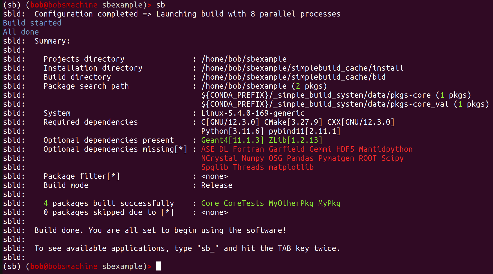

.. simplebuild documentation master file, created by
   sphinx-quickstart on Mon Nov 27 12:49:38 2023.
   You can adapt this file completely to your liking, but it should at least
   contain the root `toctree` directive.

Welcome to simplebuild's documentation!
=======================================

.. include:: wipwarning.rst

Welcome to the documentation of "simplebuild", a simple to use build system for
projects with mostly C++, C and Python code. It is primarily intended for usage
by scientific developers without a strong SW-engineering background.

.. toctree::
   :hidden:
   :maxdepth: 2

   intro.rst
   install.rst
   usage.rst
   packages.rst
   simplebuilddotcfg.rst
   envsetup.rst
   cmdline.rst
   about.rst
   contact.rst

..
  unused stuff:

  Indices and tables
  ==================

  * :ref:`genindex`
  * :ref:`modindex`
  * :ref:`search`

